<h1 align="center" style="border-bottom: none">
    Kemp Load Balancer Universal Orchestrator Extension
</h1>

<p align="center">
  <!-- Badges -->

<a href="https://github.com/Keyfactor/kemp-orchestrator/releases"></a>


</p>

<p align="center">
  <!-- TOC -->
  <a href="#support">
    <b>Support</b>
  </a>
  ·
  <a href="#installation">
    <b>Installation</b>
  </a>
  ·
  <a href="#license">
    <b>License</b>
  </a>
  ·
  <a href="https://github.com/orgs/Keyfactor/repositories?q=orchestrator">
    <b>Related Integrations</b>
  </a>
</p>

## Overview

The Kemp Load Balancer Universal Orchestrator extension enables remote management of cryptographic certificates on Kemp Load Balancers. Kemp Load Balancers use certificates to secure HTTP and HTTPS traffic efficiently, ensuring that sensitive data is encrypted during transit. This extension integrates with Keyfactor Command to automate the process of inventorying, adding, and removing certificates within Kemp Load Balancer environments. By leveraging this orchestrator, administrators can easily manage SSL/TLS certificates, ensuring the security and reliability of their load balancing infrastructure.


## Compatibility

This integration is compatible with Keyfactor Universal Orchestrator version 10.4 and later.

## Support
The Kemp Load Balancer Universal Orchestrator extension is supported by Keyfactor. If you require support for any issues or have feature request, please open a support ticket by either contacting your Keyfactor representative or via the Keyfactor Support Portal at https://support.keyfactor.com.

> If you want to contribute bug fixes or additional enhancements, use the **[Pull requests](../../pulls)** tab.

## Requirements & Prerequisites

Before installing the Kemp Load Balancer Universal Orchestrator extension, we recommend that you install [kfutil](https://github.com/Keyfactor/kfutil). Kfutil is a command-line tool that simplifies the process of creating store types, installing extensions, and instantiating certificate stores in Keyfactor Command.


## Kemp Certificate Store Type

To use the Kemp Load Balancer Universal Orchestrator extension, you **must** create the Kemp Certificate Store Type. This only needs to happen _once_ per Keyfactor Command instance.


TODO Overview is a required section
TODO Global Store Type Section is an optional section. If this section doesn't seem necessary on initial glance, please delete it. Refer to the docs on [Confluence](https://keyfactor.atlassian.net/wiki/x/SAAyHg) for more info


#### Kemp Requirements

TODO Requirements is an optional section. If this section doesn't seem necessary on initial glance, please delete it. Refer to the docs on [Confluence](https://keyfactor.atlassian.net/wiki/x/SAAyHg) for more info


#### Supported Operations

| Operation    | Is Supported                                                                                                           |
|--------------|------------------------------------------------------------------------------------------------------------------------|
| Add          | ✅ Checked        |
| Remove       | ✅ Checked     |
| Discovery    | 🔲 Unchecked  |
| Reenrollment | 🔲 Unchecked |
| Create       | 🔲 Unchecked     |

#### Store Type Creation

##### Using kfutil:
`kfutil` is a custom CLI for the Keyfactor Command API and can be used to create certificate store types.
For more information on [kfutil](https://github.com/Keyfactor/kfutil) check out the [docs](https://github.com/Keyfactor/kfutil?tab=readme-ov-file#quickstart)
   <details><summary>Click to expand Kemp kfutil details</summary>

   ##### Using online definition from GitHub:
   This will reach out to GitHub and pull the latest store-type definition
   ```shell
   # Kemp
   kfutil store-types create Kemp
   ```

   ##### Offline creation using integration-manifest file:
   If required, it is possible to create store types from the [integration-manifest.json](./integration-manifest.json) included in this repo.
   You would first download the [integration-manifest.json](./integration-manifest.json) and then run the following command
   in your offline environment.
   ```shell
   kfutil store-types create --from-file integration-manifest.json
   ```
   </details>


#### Manual Creation
Below are instructions on how to create the Kemp store type manually in
the Keyfactor Command Portal
   <details><summary>Click to expand manual Kemp details</summary>

   Create a store type called `Kemp` with the attributes in the tables below:

   ##### Basic Tab
   | Attribute | Value | Description |
   | --------- | ----- | ----- |
   | Name | Kemp | Display name for the store type (may be customized) |
   | Short Name | Kemp | Short display name for the store type |
   | Capability | Kemp | Store type name orchestrator will register with. Check the box to allow entry of value |
   | Supports Add | ✅ Checked | Check the box. Indicates that the Store Type supports Management Add |
   | Supports Remove | ✅ Checked | Check the box. Indicates that the Store Type supports Management Remove |
   | Supports Discovery | 🔲 Unchecked |  Indicates that the Store Type supports Discovery |
   | Supports Reenrollment | 🔲 Unchecked |  Indicates that the Store Type supports Reenrollment |
   | Supports Create | 🔲 Unchecked |  Indicates that the Store Type supports store creation |
   | Needs Server | ✅ Checked | Determines if a target server name is required when creating store |
   | Blueprint Allowed | 🔲 Unchecked | Determines if store type may be included in an Orchestrator blueprint |
   | Uses PowerShell | 🔲 Unchecked | Determines if underlying implementation is PowerShell |
   | Requires Store Password | 🔲 Unchecked | Enables users to optionally specify a store password when defining a Certificate Store. |
   | Supports Entry Password | 🔲 Unchecked | Determines if an individual entry within a store can have a password. |

   The Basic tab should look like this:

   

   ##### Advanced Tab
   | Attribute | Value | Description |
   | --------- | ----- | ----- |
   | Supports Custom Alias | Required | Determines if an individual entry within a store can have a custom Alias. |
   | Private Key Handling | Optional | This determines if Keyfactor can send the private key associated with a certificate to the store. Required because IIS certificates without private keys would be invalid. |
   | PFX Password Style | Default | 'Default' - PFX password is randomly generated, 'Custom' - PFX password may be specified when the enrollment job is created (Requires the Allow Custom Password application setting to be enabled.) |

   The Advanced tab should look like this:

   

   > For Keyfactor **Command versions 24.4 and later**, a Certificate Format dropdown is available with PFX and PEM options. Ensure that **PFX** is selected, as this determines the format of new and renewed certificates sent to the Orchestrator during a Management job. Currently, all Keyfactor-supported Orchestrator extensions support only PFX.

   ##### Custom Fields Tab
   Custom fields operate at the certificate store level and are used to control how the orchestrator connects to the remote target server containing the certificate store to be managed. The following custom fields should be added to the store type:

   | Name | Display Name | Description | Type | Default Value/Options | Required |
   | ---- | ------------ | ---- | --------------------- | -------- | ----------- |
   | ServerUsername | Server Username | Not used. | Secret |  | 🔲 Unchecked |
   | ServerPassword | Server Password | Kemp Api Password. (or valid PAM key if the username is stored in a KF Command configured PAM integration). | Secret |  | 🔲 Unchecked |
   | ServerUseSsl | Use SSL | Should be true, http is not supported. | Bool | true | ✅ Checked |

   The Custom Fields tab should look like this:

   

   </details>

## Installation

1. **Download the latest Kemp Load Balancer Universal Orchestrator extension from GitHub.**

    Navigate to the [Kemp Load Balancer Universal Orchestrator extension GitHub version page](https://github.com/Keyfactor/kemp-orchestrator/releases/latest). Refer to the compatibility matrix below to determine whether the `net6.0` or `net8.0` asset should be downloaded. Then, click the corresponding asset to download the zip archive.

   | Universal Orchestrator Version | Latest .NET version installed on the Universal Orchestrator server | `rollForward` condition in `Orchestrator.runtimeconfig.json` | `kemp-orchestrator` .NET version to download |
   | --------- | ----------- | ----------- | ----------- |
   | Older than `11.0.0` | | | `net6.0` |
   | Between `11.0.0` and `11.5.1` (inclusive) | `net6.0` | | `net6.0` |
   | Between `11.0.0` and `11.5.1` (inclusive) | `net8.0` | `Disable` | `net6.0` |
   | Between `11.0.0` and `11.5.1` (inclusive) | `net8.0` | `LatestMajor` | `net8.0` |
   | `11.6` _and_ newer | `net8.0` | | `net8.0` |

    Unzip the archive containing extension assemblies to a known location.

    > **Note** If you don't see an asset with a corresponding .NET version, you should always assume that it was compiled for `net6.0`.

2. **Locate the Universal Orchestrator extensions directory.**

    * **Default on Windows** - `C:\Program Files\Keyfactor\Keyfactor Orchestrator\extensions`
    * **Default on Linux** - `/opt/keyfactor/orchestrator/extensions`

3. **Create a new directory for the Kemp Load Balancer Universal Orchestrator extension inside the extensions directory.**

    Create a new directory called `kemp-orchestrator`.
    > The directory name does not need to match any names used elsewhere; it just has to be unique within the extensions directory.

4. **Copy the contents of the downloaded and unzipped assemblies from __step 2__ to the `kemp-orchestrator` directory.**

5. **Restart the Universal Orchestrator service.**

    Refer to [Starting/Restarting the Universal Orchestrator service](https://software.keyfactor.com/Core-OnPrem/Current/Content/InstallingAgents/NetCoreOrchestrator/StarttheService.htm).


6. **(optional) PAM Integration**

    The Kemp Load Balancer Universal Orchestrator extension is compatible with all supported Keyfactor PAM extensions to resolve PAM-eligible secrets. PAM extensions running on Universal Orchestrators enable secure retrieval of secrets from a connected PAM provider.

    To configure a PAM provider, [reference the Keyfactor Integration Catalog](https://keyfactor.github.io/integrations-catalog/content/pam) to select an extension and follow the associated instructions to install it on the Universal Orchestrator (remote).


> The above installation steps can be supplemented by the [official Command documentation](https://software.keyfactor.com/Core-OnPrem/Current/Content/InstallingAgents/NetCoreOrchestrator/CustomExtensions.htm?Highlight=extensions).


## Defining Certificate Stores


TODO Global Store Type Section is an optional section. If this section doesn't seem necessary on initial glance, please delete it. Refer to the docs on [Confluence](https://keyfactor.atlassian.net/wiki/x/SAAyHg) for more info

TODO Certificate Store Configuration is an optional section. If this section doesn't seem necessary on initial glance, please delete it. Refer to the docs on [Confluence](https://keyfactor.atlassian.net/wiki/x/SAAyHg) for more info


### Store Creation

#### Manually with the Command UI

<details><summary>Click to expand details</summary>

1. **Navigate to the _Certificate Stores_ page in Keyfactor Command.**

    Log into Keyfactor Command, toggle the _Locations_ dropdown, and click _Certificate Stores_.

2. **Add a Certificate Store.**

    Click the Add button to add a new Certificate Store. Use the table below to populate the **Attributes** in the **Add** form.

   | Attribute | Description                                             |
   | --------- |---------------------------------------------------------|
   | Category | Select "Kemp" or the customized certificate store name from the previous step. |
   | Container | Optional container to associate certificate store with. |
   | Client Machine | Kemp Load Balancer Client Machine and port example TestKemp:8443. |
   | Store Path | Not used just put a / |
   | Orchestrator | Select an approved orchestrator capable of managing `Kemp` certificates. Specifically, one with the `Kemp` capability. |
   | ServerUsername | Not used. |
   | ServerPassword | Kemp Api Password. (or valid PAM key if the username is stored in a KF Command configured PAM integration). |
   | ServerUseSsl | Should be true, http is not supported. |

</details>


#### Using kfutil CLI

<details><summary>Click to expand details</summary>

1. **Generate a CSV template for the Kemp certificate store**

    ```shell
    kfutil stores import generate-template --store-type-name Kemp --outpath Kemp.csv
    ```
2. **Populate the generated CSV file**

    Open the CSV file, and reference the table below to populate parameters for each **Attribute**.

   | Attribute | Description |
   | --------- | ----------- |
   | Category | Select "Kemp" or the customized certificate store name from the previous step. |
   | Container | Optional container to associate certificate store with. |
   | Client Machine | Kemp Load Balancer Client Machine and port example TestKemp:8443. |
   | Store Path | Not used just put a / |
   | Orchestrator | Select an approved orchestrator capable of managing `Kemp` certificates. Specifically, one with the `Kemp` capability. |
   | Properties.ServerUsername | Not used. |
   | Properties.ServerPassword | Kemp Api Password. (or valid PAM key if the username is stored in a KF Command configured PAM integration). |
   | Properties.ServerUseSsl | Should be true, http is not supported. |

3. **Import the CSV file to create the certificate stores**

    ```shell
    kfutil stores import csv --store-type-name Kemp --file Kemp.csv
    ```

</details>


#### PAM Provider Eligible Fields
<details><summary>Attributes eligible for retrieval by a PAM Provider on the Universal Orchestrator</summary>

If a PAM provider was installed _on the Universal Orchestrator_ in the [Installation](#Installation) section, the following parameters can be configured for retrieval _on the Universal Orchestrator_.

   | Attribute | Description |
   | --------- | ----------- |
   | ServerUsername | Not used. |
   | ServerPassword | Kemp Api Password. (or valid PAM key if the username is stored in a KF Command configured PAM integration). |

Please refer to the **Universal Orchestrator (remote)** usage section ([PAM providers on the Keyfactor Integration Catalog](https://keyfactor.github.io/integrations-catalog/content/pam)) for your selected PAM provider for instructions on how to load attributes orchestrator-side.
> Any secret can be rendered by a PAM provider _installed on the Keyfactor Command server_. The above parameters are specific to attributes that can be fetched by an installed PAM provider running on the Universal Orchestrator server itself.

</details>


> The content in this section can be supplemented by the [official Command documentation](https://software.keyfactor.com/Core-OnPrem/Current/Content/ReferenceGuide/Certificate%20Stores.htm?Highlight=certificate%20store).


## Discovering Certificate Stores with the Discovery Job

### Kemp Discovery Job
TODO Global Store Type Section is an optional section. If this section doesn't seem necessary on initial glance, please delete it. Refer to the docs on [Confluence](https://keyfactor.atlassian.net/wiki/x/SAAyHg) for more info


TODO Discovery Job Configuration is an optional section. If this section doesn't seem necessary on initial glance, please delete it. Refer to the docs on [Confluence](https://keyfactor.atlassian.net/wiki/x/SAAyHg) for more info


## Enabling API Access on Kemp LoadMaster

This guide describes how to enable and verify API access on a Kemp LoadMaster device for integration with Keyfactor Orchestrator.

---

### 🧩 Step-by-Step: Enabling API Access

#### 1. Log in to the Kemp Web UI
- Open a browser and go to your LoadMaster’s management interface:
  ```
  https://<loadmaster-hostname-or-ip>:8443
  ```
- Log in with an administrative account.

---

#### 2. Configure User Permissions and Generate an API Key
1. Navigate to:
   ```
   System Configuration → User Management
   ```
2. Under **Rules**, check the box for **Intermediate Certificates**.
   - This permission allows the orchestrator to upload or replace certificates.
3. Scroll to the **API Keys** section:
   - Click **Generate New APIKey**.
   - Copy and securely store the API key for later use.
4. (Optional) Under **Local Certificate**:
   - Click **Generate** to create a self-signed admin certificate.
   - Click **Download Certificate** if the orchestrator requires importing it.

---

#### 3. Enable API and Administrative Access
1. Go to:
   ```
   System Configuration → Remote Access
   ```
2. Under **Administrator Access**, enable the following settings:
   - ✅ **Allow Web Administrative Access**
     - **Using:** `eth0` (or the management interface)
     - **Port:** `8443`
   - ✅ **Enable API Interface**
     - **Port:** `8443`
   - ✅ **Allow Multi Interface Access** (optional, if the orchestrator connects from another subnet)
   - **Authentication Method:** `Password Only Access (default)`
   - (Optional) **Enable Software FIPS mode** if required by compliance policies.
3. Click **Set Administrative Access** (if shown), then **Save Changes**.

---

#### 4. Verify API Access
Use a command line or PowerShell session to confirm connectivity:

#### 5. Configure in Keyfactor Orchestrator
When setting up your Kemp Orchestrator Store Type, provide the following values:

| Field | Value |
|-------|--------|
| **ServerUsername** | LoadMaster admin username |
| **ServerPassword** | API Key generated earlier |
| **ServerUseSsl** | true |
| **ServerHostname** | e.g., `testkemp:8443` |

---

#### ✅ Summary of Required Settings

| Setting | Location | Value |
|----------|-----------|--------|
| Allow Web Administrative Access | System Configuration → Remote Access | Enabled |
| Enable API Interface | System Configuration → Remote Access | Enabled |
| API Port | System Configuration → Remote Access | 8443 |
| Intermediate Certificates Rule | System Configuration → User Management | Enabled |
| API Key | System Configuration → User Management | Generated |
| Authentication Method | System Configuration → Remote Access | Password Only (default) |

---

### TEST CASES
Case Number|Case Name|Case Description|Overwrite Flag|Alias Name|Expected Results|Passed|Screenshots
------------|---------|----------------|--------------|----------|----------------|--------------|------------
1|New Add New Alias SSL Certificates|Will Create a new SSL Certificate|False|TC1|New SSL Certificate with Alias TC1 Created On Kemp LoadMaster|True|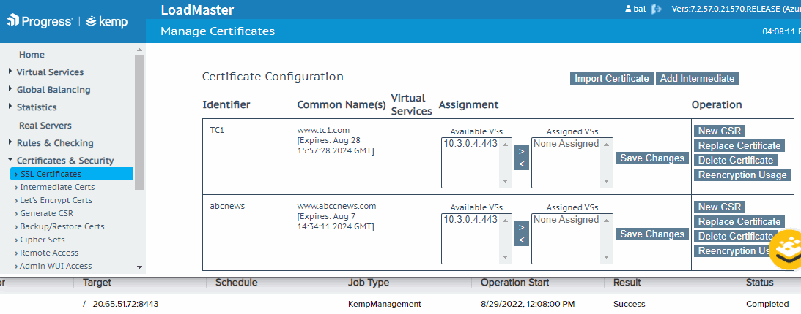
2|Replace Alias SSL Certificates|Will Replace SSL Certificate|True|TC1|SSL Certificate with Alias TC1 Replaced On Kemp LoadMaster|True|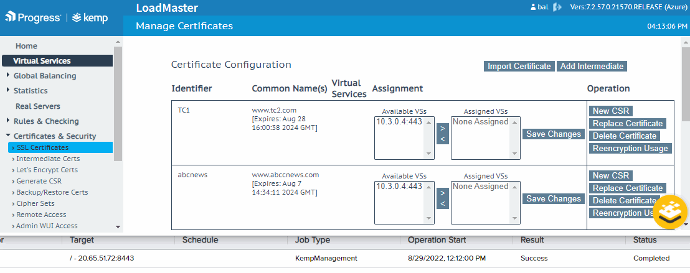
3|Replace Alias SSL Certificates no Overwrite|Will Replace SSL Certificate|False|TC1|Error should occur stating Overwrite flag should be used|True|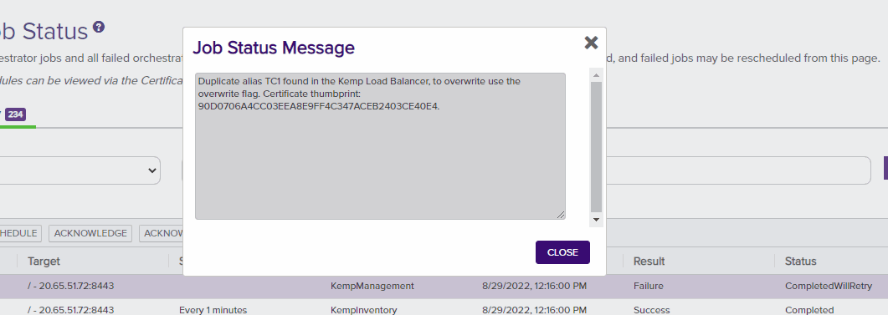
4|Replace Alias Bound SSL Certificates|Will Replace Bound SSL Certificate|True|TC1|Bound Certificate should be replaced|True|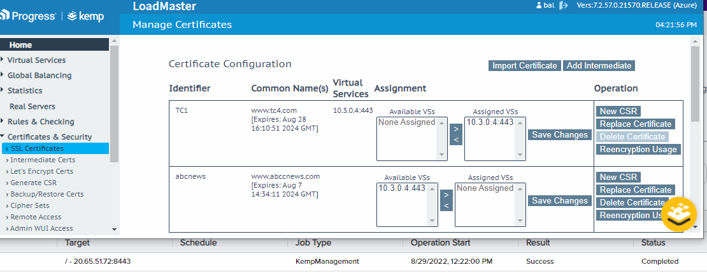
5|Remove Bound SSL Certificate|Should fail as you cannot remove Bound Certificates|N/A|TC1|Error Occurs stating you cannot remove bound certificates.|True|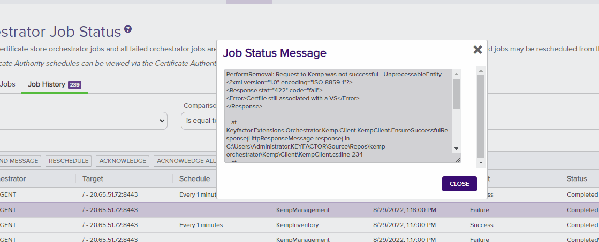
6|Remove UnBound SSL Certificate|Try to remove SSL Certificate that is UnBound|N/A|TC8a|Unbound Certificate Is Removed from LoadMaster.|True|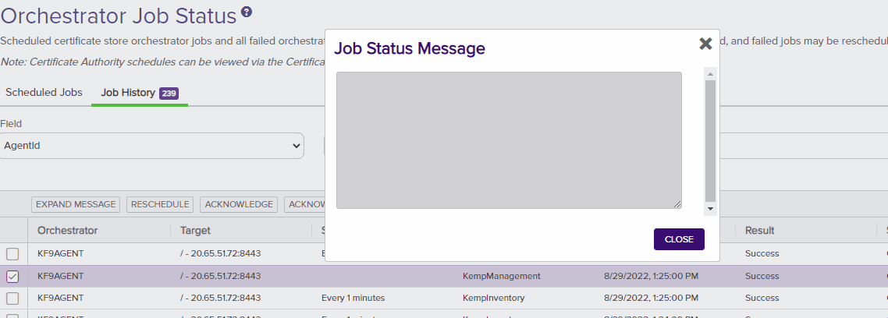
7|New Add New Alias Intermediate Certificates|Will Create a new Intermediate Certificate|False|TC8b|New Intermediate Certificate with Alias TC8b Created On Kemp LoadMaster|True|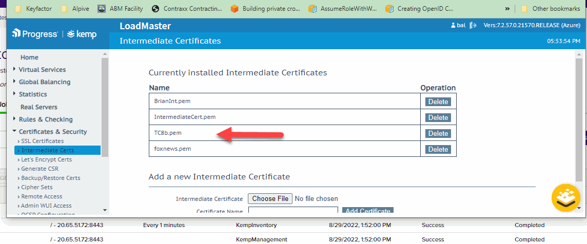
8|Replace Alias Intermediate Certificates|You cannot replace intermediate certificates|True|TC8b|Command Failed: Filename already exists|True|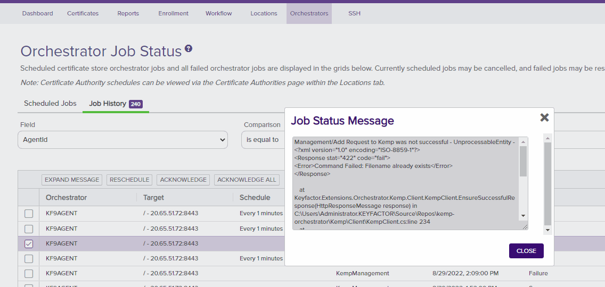
9|Remove Intermediate Certificates|Intermediate Certificate Will Be Removed|N/A|TC8b|Intermediate Certificate Is Removed From Keyfactor and the LoadMaster|True|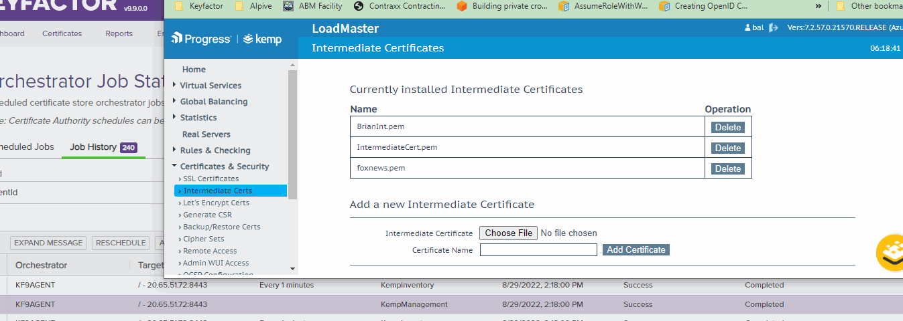
10|Inventory Intermediate Certificates|Intermediate Certificate Will Be Inventoried|N/A|N/A|Intermediate Certificate Is Inventoried to Keyfactor|True|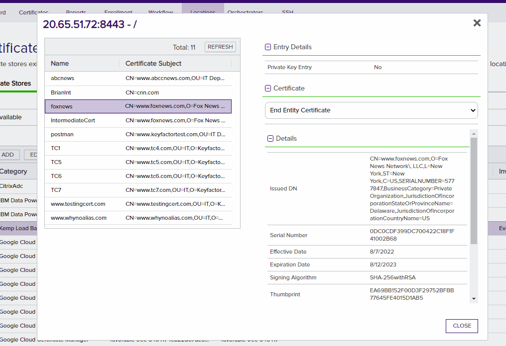
11|Inventory SSL Certificates|SS: Certificate Will Be Inventoried|N/A|N/A|SSL Certificate Is Inventoried to Keyfactor|True|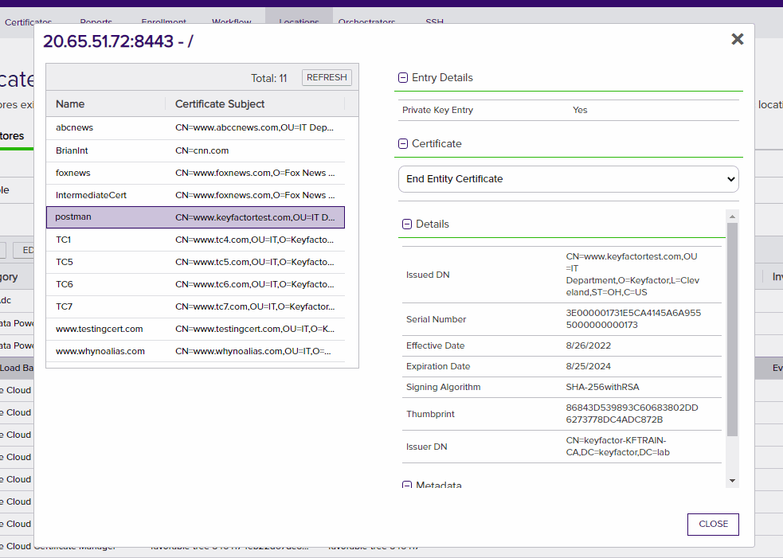


## License

Apache License 2.0, see [LICENSE](LICENSE).

## Related Integrations

See all [Keyfactor Universal Orchestrator extensions](https://github.com/orgs/Keyfactor/repositories?q=orchestrator).