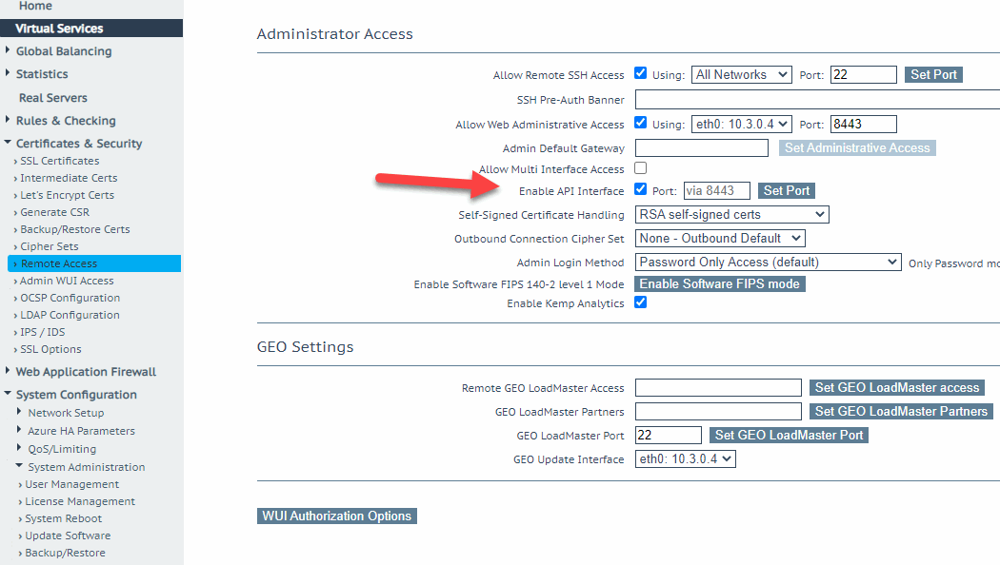
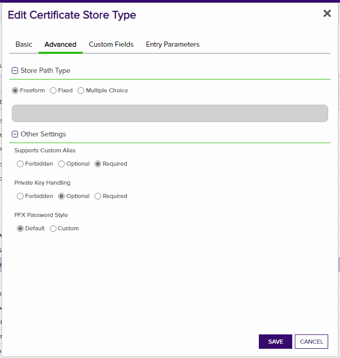

# Kemp Load Balancer

Kemp Load Balancer for Add, Remove and Inventory.

#### Integration status: Pilot - Ready for use in test environments. Not for use in production.

## About the Keyfactor Universal Orchestrator Capability

This repository contains a Universal Orchestrator Capability which is a plugin to the Keyfactor Universal Orchestrator. Within the Keyfactor Platform, Orchestrators are used to manage “certificate stores” &mdash; collections of certificates and roots of trust that are found within and used by various applications.

The Universal Orchestrator is part of the Keyfactor software distribution and is available via the Keyfactor customer portal. For general instructions on installing Capabilities, see the “Keyfactor Command Orchestrator Installation and Configuration Guide” section of the Keyfactor documentation. For configuration details of this specific Capability, see below in this readme.

The Universal Orchestrator is the successor to the Windows Orchestrator. This Capability plugin only works with the Universal Orchestrator and does not work with the Windows Orchestrator.

---

## Platform Specific Notes

The Keyfactor Universal Orchestrator may be installed on either Windows or Linux based platforms. The certificate operations supported by a capability may vary based what platform the capability is installed on. The table below indicates what capabilities are supported based on which platform the encompassing Universal Orchestrator is running.
| Operation | Win | Linux |
|-----|-----|------|
|Supports Management Add|&check; |  |
|Supports Management Remove|&check; |  |
|Supports Create Store|  |  |
|Supports Discovery|  |  |
|Supports Renrollment|  |  |
|Supports Inventory|&check; |  |

---

**Kemp Load Balancer Configuration (LoadMaster)**

**Overview**

The Kemp Load Balancer Orchestrator (LoadMaster) remotely manages certificates on the Kemp Virtual LoadMaster Load Balancer Product

This agent implements three job types – Inventory, Management Add, and Management Remove. Below are the steps necessary to configure this AnyAgent.  It supports adding certificates with or without private keys.

**Kemp LoadMaster Configuration**

1. Read up on [Kemp LoadMaster Load Balancer](https://kemptechnologies.com/virtual-load-balancer) and how it works.
2. You need to setup a user with the following permissions for API Access on the Kemp Load Balancer

3. The following Api Access is needed:

**1. Create the New Certificate Store Type for the Kemp Load Balancer Orchestrator**

In Keyfactor Command create a new Certificate Store Type similar to the one below:

#### STORE TYPE CONFIGURATION
SETTING TAB  |  CONFIG ELEMENT	| DESCRIPTION
------|-----------|------------------
Basic |Name	|Descriptive name for the Store Type.  Kemp Load Balancer can be used.
Basic |Short Name	|The short name that identifies the registered functionality of the orchestrator. Must be Kemp
Basic |Custom Capability|Unchecked
Basic |Job Types	|Inventory, Add, and Remove are the supported job types. 
Basic |Needs Server	|Must be checked
Basic |Blueprint Allowed	|Must be checked
Basic |Requires Store Password	|Determines if a store password is required when configuring an individual store.  This must be unchecked.
Basic |Supports Entry Password	|Determined if an individual entry within a store can have a password.  This must be unchecked.
Advanced |Store Path Type| Determines how the user will enter the store path when setting up the cert store.  Freeform
Advanced |Supports Custom Alias	|Determines if an individual entry within a store can have a custom Alias.  This must be Required
Advanced |Private Key Handling |Determines how the orchestrator deals with private keys.  Optional
Advanced |PFX Password Style |Determines password style for the PFX Password. Default
Custom Fields|N/A| There are no Custom Fields
Entry Parameters|N/A| There are no Entry Parameters

**Basic Settings:**

**Advanced Settings:**

**Custom Fields:**

**Entry Params:**

**2. Register the Kemp Load Balancer Orchestrator with Keyfactor**
See Keyfactor InstallingKeyfactorOrchestrators.pdf Documentation.  Get from your Keyfactor contact/representative.

**3. Create a Kemp Load Balancer Store within Keyfactor Command**
In Keyfactor Command create a new Certificate Store similar to the one below

#### STORE CONFIGURATION 
CONFIG ELEMENT	|DESCRIPTION
----------------|---------------
Category	|The type of certificate store to be configured. Select category based on the display name configured above "Kemp Load Balancer".
Container	|This is a logical grouping of like stores. This configuration is optional and does not impact the functionality of the store.
Client Machine	|Server and port of the kemp load balancer sample is 20.62.33:8443.
Store Path	|Not used just put a "/".
Orchestrator	|This is the orchestrator server registered with the appropriate capabilities to manage this certificate store type. 
Inventory Schedule	|The interval that the system will use to report on what certificates are currently in the store. 
Use SSL	|This should be checked.
User	|This is not necessary.
Password |This is the Kemp Load Balancer API Key setup for the user created in Kemp described in the "LoadMaster Configuration Section".

*** 

#### TEST CASES
Case Number|Case Name|Case Description|Overwrite Flag|Alias Name|Expected Results|Passed|Screenshots
------------|---------|----------------|--------------|----------|----------------|--------------|------------
1|New Add New Alias SSL Certificates|Will Create a new SSL Certificate|False|TC1|New SSL Certificate with Alias TC1 Created On Kemp LoadMaster|True|
2|Replace Alias SSL Certificates|Will Replace SSL Certificate|True|TC1|SSL Certificate with Alias TC1 Replaced On Kemp LoadMaster|True|
3|Replace Alias SSL Certificates no Overwrite|Will Replace SSL Certificate|False|TC1|Error should occur stating Overwrite flag should be used|True|
4|Replace Alias Bound SSL Certificates|Will Replace Bound SSL Certificate|True|TC1|Bound Certificate should be replaced|True|
5|Remove Bound SSL Certificate|Should fail as you cannot remove Bound Certificates|N/A|TC1|Error Occurs stating you cannot remove bound certificates.|True|
6|Remove UnBound SSL Certificate|Try to remove SSL Certificate that is UnBound|N/A|TC8a|Unbound Certificate Is Removed from LoadMaster.|True|
7|New Add New Alias Intermediate Certificates|Will Create a new Intermediate Certificate|False|TC8b|New Intermediate Certificate with Alias TC8b Created On Kemp LoadMaster|True|
8|Replace Alias Intermediate Certificates|You cannot replace intermediate certificates|True|TC8b|Command Failed: Filename already exists|True|
9|Remove Intermediate Certificates|Intermediate Certificate Will Be Removed|N/A|TC8b|Intermediate Certificate Is Removed From Keyfactor and the LoadMaster|True|
10|Inventory Intermediate Certificates|Intermediate Certificate Will Be Inventoried|N/A|N/A|Intermediate Certificate Is Inventoried to Keyfactor|True|
11|Inventory SSL Certificates|SS: Certificate Will Be Inventoried|N/A|N/A|SSL Certificate Is Inventoried to Keyfactor|True|

