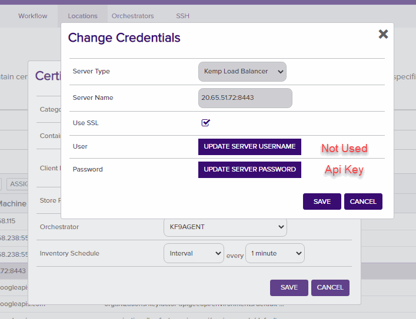

**Google Cloud Platform Certificate Manager**

**Overview**

The GCP Certificate Manager Orchestrator remotely manages certificates on the Google Cloud Platform Certificate Manager Product

This agent implements three job types – Inventory, Management Add, and Management Remove. Below are the steps necessary to configure this AnyAgent.  It supports adding certificates with or without private keys.

**Google Cloud Configuration**

1. Read up on [Google Certificate Manager](https://cloud.google.com/certificate-manager/docs) and how it works.
2. A Google Service Account is needed with the following permissions (Note: Workload Identity Management Should be used but at the time of the writing it was not available in the .net library yet)

3. The following Api Access is needed:

4. Dowload the Json Credential file as shown below:

**1. Create the New Certificate Store Type for the GCP Certificate Manager Orchestrator**

In Keyfactor Command create a new Certificate Store Type similar to the one below:

#### STORE TYPE CONFIGURATION
SETTING TAB  |  CONFIG ELEMENT	| DESCRIPTION
------|-----------|------------------
Basic |Name	|Descriptive name for the Store Type.  Google Cloud Certificate Manager can be used.
Basic |Short Name	|The short name that identifies the registered functionality of the orchestrator. Must be GcpCertMgr
Basic |Custom Capability|Checked with Name GcpCertManager
Basic |Job Types	|Inventory, Add, and Remove are the supported job types. 
Basic |Needs Server	|Must be checked
Basic |Blueprint Allowed	|Unchecked
Basic |Requires Store Password	|Determines if a store password is required when configuring an individual store.  This must be unchecked.
Basic |Supports Entry Password	|Determined if an individual entry within a store can have a password.  This must be unchecked.
Advanced |Store Path Type| Determines how the user will enter the store path when setting up the cert store.  Freeform
Advanced |Supports Custom Alias	|Determines if an individual entry within a store can have a custom Alias.  This must be Required
Advanced |Private Key Handling |Determines how the orchestrator deals with private keys.  Required
Advanced |PFX Password Style |Determines password style for the PFX Password. Default
Custom Fields|Google Cloud Platform Project Location|Name:Location Display Name:Location Type:String Default Value:global Required:True
Custom Fields|Google Cloud Platform Project Number|Name:Project Number Display Name:Project Number Type:String Default Value:N/A Required:True
Entry Parameters|N/A| There are no Entry Parameters

**Basic Settings:**

**Advanced Settings:**

**Custom Fields:**

**Entry Params:**

**2. Register the GCP Certificate Manager Orchestrator with Keyfactor**
See Keyfactor InstallingKeyfactorOrchestrators.pdf Documentation.  Get from your Keyfactor contact/representative.

**3. Create a GCP Certificate Manager Certificate Store within Keyfactor Command**
In Keyfactor Command create a new Certificate Store similar to the one below

#### STORE CONFIGURATION 
CONFIG ELEMENT	|DESCRIPTION
----------------|---------------
Category	|The type of certificate store to be configured. Select category based on the display name configured above "GCP Certificate Manager".
Container	|This is a logical grouping of like stores. This configuration is optional and does not impact the functionality of the store.
Client Machine	|The name of the Google Certificate Manager Credentials File.  This file should be stored in the same directory as the Orchestrator binary.  Sample is "favorable-tree-346417-feb22d67de35.json".
Store Path	|This will be the ProjectId of the Google Cloud Project.  Sample here is "favorable-tree-346417".  See above image.
Location|global is the default but could be another region based on the project.
Project Number| As shown in the above image, this can be obtained from the project information in Google Cloud.
Orchestrator	|This is the orchestrator server registered with the appropriate capabilities to manage this certificate store type. 
Inventory Schedule	|The interval that the system will use to report on what certificates are currently in the store. 
Use SSL	|This should be checked.
User	|This is not necessary.
Password |This is not necessary.

*** 

#### Usage

**Adding New Certificate No Map Entry**

*** 

**Adding New Certificate With Map Entry**

*** 

**Replace Certficate With Map Entry**

*** 

**Replace Certficate No Map Entry**

*** 

**Replace Certficate With Map Entry**

*** 

**Replace Certficate No Map Entry**

***

**Remove Certificate Map Entry**

*** 

**Remove Certficate No Map Entry**

#### TEST CASES
Case Number|Case Name|Case Description|Overwrite Flag|Alias Name|Expected Results|Passed
------------|---------|----------------|--------------|----------|----------------|--------------
1|Fresh Add with New Map and Entry|Will create new map, map entry and cert|False|map12/mentry12/cert12|New Map will be created, New Map Entry Created, New Cert Created|True
1a|Try Replace without Overwrite|If user does not use overwrite flag, should error out on same entry replace|False|map12/mentry12/cert12|Error Occurs Saying to Use Overwrite Flag|True
1b|Try Replace with Overwrite|Should  delete and re-insert mapentry and certificate|True|map12/mentry12/cert12|Replaced Cert Map Entry and Certificate|True
2|Fresh Add with Cert Only (No Map)|Will create cert that is not tied to map|False|cert40|Created Certificate with alias cert40|True
2a|Try Replace without Overwrite|If user does not use overwrite flag, should error out on same entry replace|False|Cert40|Error Occurs Saying to Use Overwrite Flag|True
2b|Try Replace with Overwrite|If user uses overwrite will replace cert|True|cert40|Certificate with be replaced with alias of cert40|True
3|Fresh Add with new entry to existing map|Will create cert where entry is tied to an existing map|False|map12/mentry50/cert50|Created Certificate with alias map12/mentry50/cert50|True
3a|Try Replace without Overwrite|If user does not use overwrite flag, should error out on same entry replace|False|map12/mentry50/cert50|Error Occurs Saying to Use Overwrite Flag|True
4|Remove Cert In Map|Try to remove cert in existing map.  Should leave map and delete cert map entry and cert.|N/A|map12/mentry50/cert50|Cert cert50 and map entry mentry50 should be deleted.|True
4a|Remove Standalone cert (No Map)|Try to remove cert without a map entry or map.|N/A|cert40|Cert cert40 should be deleted.|True

